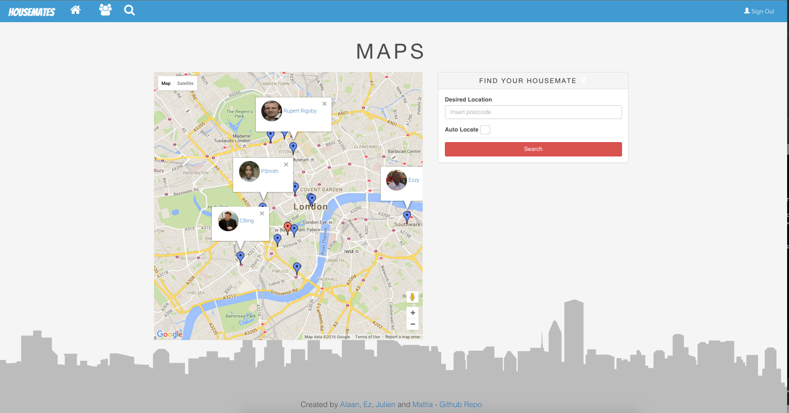

# Tenant-App

### Visit the web page at: **http://housematey.herokuapp.com/**

#### Home page


#### Map search



#### Task
A web and iOS application to relieve the stress of finding new housemates. The
App let you to create your own renting history, find people (through Google Maps
API) with your needs and
connect with them.

#### User story
```
As a User
So that I can create an account
I want to sign up

As a User
So that I can personalise my account
I want to add an about me in order to find people with the same needs

As a User
So that I can add my previous houses
I want to add as many properties as a want

As a User
So that I can find people who wants to live in my desire location
I want to perform a search through Google Maps to find them

As a User
So that I can connect with them
I want to send a connection request

```
#### Technology that I have used

* Javascript
* AngularJs
* NodeJs
* Express
* MongoDB
* Google Map API
* JQuery
* Jasmine
* Karma

##### For the iOS app

* Apple Swift (2.1)


#### To run the app locally
```
$ mongod
```
and in an other terminal tab:
```
node server
```
Then open your browser and paste:
```
http://localhost:1337/
```
If you have problem to run mongod
```
$ brew unpdate
$ brew install mongodb
```
If you are still having problems, try to create the data/db folder:
```
$ sudo mkdir -p /data/db
```
If says that you haven't got the permission, run:
```
sudo chown -R `id -u` /data/db
```

#### Main challenges that I've faced
```
The main challenges that I faced was to create an API to facilitate the communication
between the web site and iOS application and learn a Apple Swift (2.1) given a lack
of resources for the latest version.

```

#### Next Steps
* Integrate the reviews
* Add the Endorsement
* Add the internal messagging
* Create a documents store

